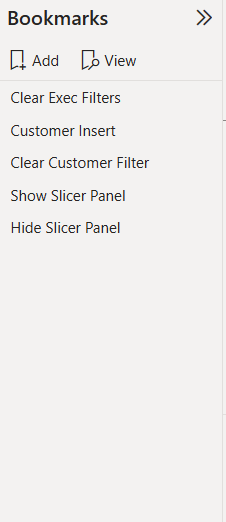

# PowerBI-Enterprise-Business-Intelligence-System
End-to-end Enterprise Business Intelligence project using Microsoft Power BI Desktop. Features Star Schema data modeling, advanced DAX measures, Calculation Groups, What-If parameters, Bookmarks UX, and AI-driven root cause analytics.

# AdventureWorks Enterprise Business Intelligence System


An end-to-end Enterprise Business Intelligence solution developed using **Microsoft Power BI Desktop**, based on global manufacturing and sales operations data from **AdventureWorks**.

This repository demonstrates the entire analytics engineering lifecycle: raw data ingestion and transformation via Power Query, Star Schema relational modeling, complex DAX measures, calculation groups, what-if sensitivity simulations, custom visual interactions, and AI-driven root-cause investigation.


## 📂 Repository Structure

```text
├── Bookmarks.png
├── Calculation Group.png
├── Custom Tooltip.png
├── Customer Detail 1.png
├── Data model.png
├── Decomposition Tree.png
├── Excecutive Dashboard 1.png
├── Excecutive Dashboard 2.png
├── Executive_Dashboard_slicer_menu.png
├── Map.png
├── Product Detail 1.png
├── Product Detail 2.png
├── Product Detail 3.png
└── README.md
```

---
## AdventureWorks Enterprise Business Intelligence System


An end-to-end Enterprise Business Intelligence solution developed using **Microsoft Power BI Desktop**, based on global manufacturing and sales operations data from **AdventureWorks**.

This repository demonstrates the entire analytics engineering lifecycle: raw data ingestion and transformation via Power Query, Star Schema relational modeling, complex DAX measures[ : 16], calculation groups, what-if sensitivity simulations, custom visual interactions, and AI-driven root-cause investigation.

---

## Project Overview & Business Scenario

AdventureWorks is a global manufacturing company producing bicycles, accessories, and components. The executive and operations leadership required a unified, robust analytical platform to replace fragmented reporting spreadsheets, specifically aiming to:

* **Monitor Executive KPIs:** Track real-time sales revenue, margins, total volumes, and return rates across product tiers.
* **Perform Sensitivity & Scenario Analysis:** Evaluate price adjustments dynamically to simulate the impact on operating profit.
* **Understand Customer Value:** Segment international clientele by occupation, earnings, and order frequencies to support targeted sales efforts.
* **Identify Operational Inefficiencies:** Trace the underlying causes of elevated return rates through multi-level breakdown analysis.

---

## Core Competencies & Skills Acquired

* **Data Modeling & Architecture:** Designing optimized Star and Snowflake relational schemas using strict $1:*$ cardinality and single-direction cross-filtering.
* **Advanced DAX & Semantic Modeling:** Leveraging scalar calculations, iteration (`SUMX`), context transitions (`CALCULATE`), and time intelligence formulas alongside **Calculation Groups**.
* **Application-Grade UX/UI:** Utilizing Power BI **Bookmarks**, **Selection Panes**, and shape triggers to build collapsible slide-out menus.
* **Contextual Data Discovery:** Embedding custom micro-canvas report tooltips to provide on-demand granularity without screen transitions.
* **AI & Augmented Diagnostics:** Incorporating **Decomposition Trees** and native Power BI forecasting models to identify anomalies and operational drivers.

---

## Data Model Architecture (Star Schema)

The semantic data layer was built according to relational data warehouse design standards[ : 16]. It segregates heavy transactional tables (facts) from business context lookup tables (dimensions).


<p align="center">
  
</p>

### Relational Schema Breakdown
* **Fact Tables:**
  * `Sales Data`: Granular transactional sales logs including order keys, customer IDs, product references, and quantities.
  * `Returns Data`: Product return transactions linked via product and territory foreign keys.
* **Dimension Tables (Lookups):**
  * `Calendar Lookup`: Continuous date hierarchy enabling time-intelligence calculations.
  * `Customer Lookup`: Customer demographic metadata, annual income, and employment classifications.
  * `Product Lookup`: Base product registry containing unit costs, SKU metadata, and wholesale prices.
  * `Product Subcategories Lookup` & `Product Category Lookup`: Normalized hierarchical dimension tiers.
  * `Territory Lookup`: Geographic references connecting country and continental markets.
* **Semantic Artifacts:** Contains 34 explicitly defined DAX measures and 1 dedicated Calculation Group.

---

## Report Pages & Analytical Walkthrough

### 1. Executive Performance Dashboard
The primary landing view tailored for executive decision-makers to track high-level operational health.
* **Core Scorecards:** Total Revenue ($9.32M), Total Cost ($5.36M), Total Orders (10.70K), and Return Rate (2.13%).
* **Revenue Trend & Forecasting:** Longitudinal time series tracing monthly progress with dynamic statistical projections.
* **Visuals & Tables:** Category order share combined with a Top 10 Products performance matrix featuring conditional bar indicators.


---

### 2. Collapsible Flyout Filter Panel (State Management)
Maintains maximum canvas space by hiding global filtering interfaces until invoked by the user.
* **Mechanics:** Coordinated using the **Bookmarks Pane** and **Selection Pane** (`Show Slicer Panel`, `Hide Slicer Panel`, `Clear Exec Filters`).
* **Interactive Slicers:** Date range selectors (2020–2022) and multi-continent selectors (Europe, North America, Pacific).




---

### 3. Dynamic Visual Report-Page Tooltip
Enhances visual storytelling by revealing nested analytics on mouse hover.
* **On-Demand Context:** Hovering over any item in the category distribution chart opens a micro-dashboard displaying weekly sales volume trends, total profit, and return metrics for that specific category.

<!-- ΣΥΡΕ ΤΗΝ ΕΙΚΟΝΑ ΤΟΥ HOVER TOOLTIP ΕΔΩ (ή assets/04_category_tooltip.png) -->


---

### 4. Global Geographic Footprint (Map View)
Provides spatial context for international commercial activities.
* **Choropleth/Bubble Mapping:** Regional bubble sizing reflects order density across the United States, Canada, the United Kingdom, France, Germany, and Australia.
* **Continent Selectors:** Quick-access buttons allow dynamic zooming between major geographic markets.


---

### 5. Product Detail & Sensitivity "What-If" Analysis
Detailed SKU-level performance tracking equipped with live simulation tools.
* **Target Gauges:** Visualizing actual operational performance against planned monthly quotas (Orders, Revenue, and Profit vs Target).
* **What-If Pricing Slider:** An interactive parameter (`Price Adjustment`) that dynamically recalculates projected margins (`Adjusted Profit`) across the entire catalog.
* **Metric Switcher:** Interactive control enabling seamless switching between volume, revenue, profit, and return trends on a single visual.


---

### 6. Customer Demographics & Behavioral Profiling
Granular analysis evaluating client segment characteristics and value distribution.
* **Demographic Distributions:** Donut charts highlighting customer composition across occupational groups (Professional, Skilled Manual, Management, Clerical) and annual income tiers.
* **Customer Ledger:** Granular transaction tracking evaluating individual revenue contributions, total historical order counts, and automated narrative highlights.


---

### 7. AI Decomposition Tree (Root-Cause Investigation)
Harnessing Power BI native AI capabilities to decompose complex aggregated metrics.
* **Multi-Tier Diagnostics:** Drills down automatically into Return Rates across Category $\rightarrow$ Subcategory $\rightarrow$ Product Model.
* **Root-Cause Discovery:** Quickly pinpoints outlier lines (such as specific Touring Bike models) that drive elevated return volumes.


---

### 8. Calculation Groups & Dynamic Time Intelligence
Implementing advanced semantic structures to eliminate measure duplication and streamline time-series analysis.
* **Unified Matrix Reporting:** Allows users to pick any primary business metric (`Total Cost`, `Total Revenue`, `Total Profit`, `Total Orders`, `Total Quantity Sold`).
* **Automated Time Dimensions:** Simultaneously calculates and presents `Current Measure`, `MoM %` (Month-over-Month change), `Previous Month`, and `QTD` (Quarter-to-Date) totals.


---

## Sample DAX Formulations

```dax
// 1. Month-over-Month (MoM) Growth Percentage
MoM % = 
VAR CurrentValue = [Current Measure]
VAR PrevValue = [Previous Month]
RETURN
DIVIDE(CurrentValue - PrevValue, PrevValue, 0)

// 2. Dynamic What-If Adjusted Profit
Adjusted Profit = 
SUMX(
    'Sales Data',
    [Adjusted Price] - RELATED('Product Lookup'[ProductCost])
)

// 3. Operational Return Rate
Return Rate = 
DIVIDE([Total Returns], [Total Orders], 0)


